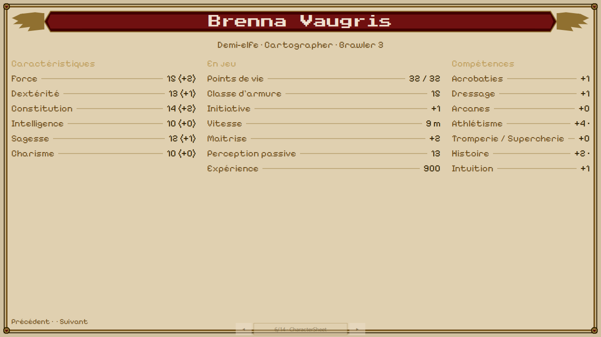
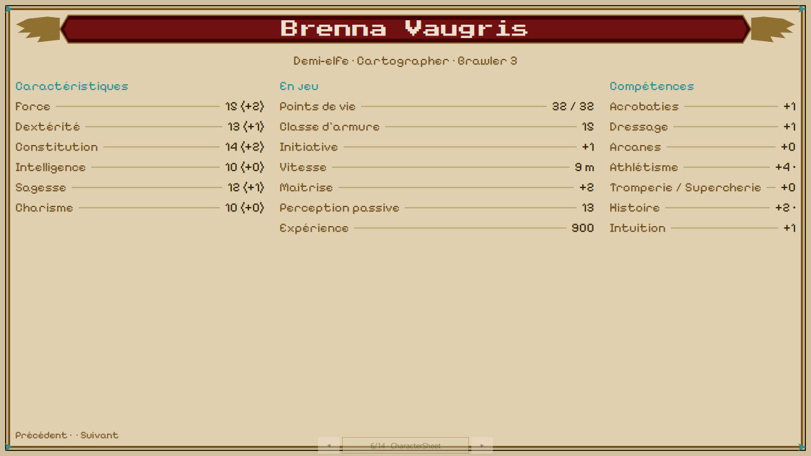

# LOT-87 — Charte v2 et intégration des maquettes {#lot-87}

> Statut : **en cours**.
> Prérequis : `LOT-86`, `LOT-39`.

## Objectif

Adopter les dix maquettes du pack UI comme charte visuelle v2, et transcrire les écrans du jeu sur
cette base : panneaux sombres et parchemin, `Cinzel` en titres, `IM Fell English` en corps,
illustrations peintes. Les assets (cadres 9-patch, plaques, boutons, fonds) sont produits à part, à
1080p, depuis un cahier des assets — jamais découpés des maquettes elles-mêmes, qui restent des
références de cotes et de composition.

## Pourquoi les maquettes remplacent la charte parchemin pixel

Les maquettes du pack contredisent la direction retenue par les `LOT-66` et `LOT-76` (parchemin de
Tanares, sans illustration peinte). Elles sont malgré tout la matière la plus riche dont dispose le
projet pour les dix écrans qu'elles couvrent : la décision, prise le 11 septembre 2026, est de les
adopter comme charte v2 plutôt que de continuer à les ignorer. Le prix assumé : deux directions
graphiques auront coexisté dans l'historique du dépôt, la seconde remplaçant entièrement la
première.

## Ce que Claude ne produit pas

Aucun cadre doré, aucun fond peint n'est dessiné par un modèle Claude. La phase 2 sépare deux
métiers : Claude écrit le cahier des assets (liste, dimensions, marges 9-patch, description,
prompt de génération par pièce) et vérifie/enregistre ce qui revient ; la production des images
passe par un générateur d'images ou un illustrateur, à partir de ce cahier.

## Programme, en six phases

1. **Socle vert** — dépôt propre (branches mortes archivées et retirées, débris de travail retirés,
   maquettes déplacées dans ce dossier), lot inscrit à la feuille de route.
2. **Le module de conception** — Qt Design Studio 4.8.2 ouvre chaque `*Form.ui.qml` en mode
   conception, le jeu démarre : trois modules (`Jadg.Ui`, `Jadg.App`, `Jadg.Runtime`), des
   doublures QML pour les types C++, un garde-fou de compatibilité réécrit en contrat plutôt qu'en
   structure CMake.
3. **Charte v2 et matière première** — la charte écrite dans cet epic, les jetons de `Tokens.qml`
   étendus, les polices `Cinzel` et `IM Fell English` déposées, le cahier des assets, le manifeste
   étendu aux images produites, et les briques QML (`PanelFrame`, `OrnateButton`, `StatMedallion`,
   etc.) qui les consomment.
4. **Les écrans, un par Pull Request** — menu principal, options, crédits, fiche de personnage,
   inventaire et équipement, carte du monde, équipe de mercenaires, compétences et sorts ; pause,
   dialogue, marchand et journal restylés sans redessin.
5. **Le cadre du HUD** — `CombatHudForm` et `GameViewForm` réécrits avec le cadre de la maquette,
   branchement différé aux lots qui fourniront les données réelles.
6. **Retrait** — le dossier `JustAnotherDnDGame_UI_ASSET_PACK/` et l'ancienne charte (`LOT-86`)
   supprimés une fois qu'aucun écran ne les cite plus.

## Phase 1 — le module de conception

### T1.1 — Le diagnostic, avant d'écrire

L'hypothèse du plan — *le mode conception est grisé parce que `Jadg.Ui` mêle QML et C++* — a été
mise à l'épreuve le 12 septembre 2026 en ouvrant `Source/Ui/JadgUi.qmlproject` de l'état
`main` (phase 0) dans Qt Design Studio **4.8.3** (Qt 6.8.7 embarqué, `qmlpuppet-4.8.3.exe`), puis
en résolvant chaque fichier avec le `qmllint` de ce même Qt. **Elle est fausse dans sa forme, et
juste dans son fond.**

Ce qui a été observé :

- Le mode conception **n'est pas grisé** : les formulaires s'ouvrent, le panneau Propriétés
  fonctionne, trois marionnettistes tournent (kit « Desktop Qt 6.8.7 », style Basic).
- La bibliothèque de composants liste **chaque dossier « (vide) »** — `Controls`, `Screens`,
  `Theme`, `Logic` : l'artiste ne peut poser aucune brique du projet depuis ce panneau. Première
  hypothèse : le `qmldir` engendré ne porte pas `designersupported`. **Infirmée** après coup (voir
  ci-dessous) : le mot est posé, le panneau reste vide.
- Le panneau Problèmes signale « Nom pour le type `CharacterSheetModel` manquant » et
  « `InventoryModel` manquant » (`CharacterSheet.qml`, `Inventory.qml`) : les jumeaux qui
  instancient un type C++ restent irrésolus, et `GameViewForm.ui.qml` — un *formulaire* —
  nommait `GameViewport`, lui aussi C++. Le marionnettiste ne charge aucun plugin C++ du projet ;
  tout type C++ mêlé au module des formulaires y est irrésolvable.
- Avec le `qmllint` 6.8.7 de l'atelier et `-I Source/Ui` : les 13 formulaires purs se résolvent ;
  `GameViewForm.ui.qml`, `Main.qml`, `ScreenStack.qml` et tous les jumeaux échouent sur les types
  C++ (« unqualified access » sur `OptionsModel`, `ScreenRouter`, `PendingData`).

**Cause nommée** : un module unique (`Jadg.Ui`, porté par l'exécutable) qui contient à la fois les
formulaires, le câblage et les types C++. **Critère qui la fait disparaître** : chaque formulaire
et chaque jumeau se résout avec le `qmllint` du Qt embarqué de l'atelier, sans plugin C++, et
l'atelier les ouvre sans un problème signalé.

**Ce qui reste ouvert : le panneau Composants.** Une fois la phase 1 faite (0 problème, 0
avertissement dans l'atelier), le panneau liste toujours chaque dossier « (vide) », y compris
`Mocks`. Une expérience à part — un projet jetable avec deux modules `designersupported`, l'un à
fichiers plats dans le répertoire du `qmldir`, l'autre en sous-dossiers — donne le même résultat
pour les deux : ni la disposition ni le mot ne suffisent. Ce panneau n'est pas un critère de la
phase 1 ; l'artiste pose une brique depuis la galerie `DesignStudio/Main.ui.qml` ou par le code, et
la phase 2 (T2.7, les briques de la charte v2) instruira ce qu'il exige de plus — un `.qmltypes`
ou un `designer/*.metainfo`, probablement.

La branche abandonnée (125 commits) visait le bon découpage, mais l'a fait en laissant les
fichiers en place et en réécrivant leurs chemins de ressource un par un, avec des cibles qui
vérifiaient des fichiers engendrés. C'est cette plomberie qui a dérivé, pas l'idée.

### T1.2 à T1.4 — Ce qui a été fait

Trois modules QML, **chacun déclaré dans le répertoire de ses fichiers**, sans un seul alias de
ressource :

| Module | Répertoire | Contenu | Cible |
|---|---|---|---|
| `Jadg.Ui` | `Source/Ui` | formulaires, contrôles, jetons, galerie ; QML pur, `designersupported` | `JadgUi` (statique) |
| `Jadg.Runtime` | `Source/HMI/Runtime` | les neuf types C++ exposés au QML, dont la surface de rendu | `JadgRuntime` (statique) |
| `Jadg.App` | `Source/App` (fichiers sous `Game/Qml/`) | `Main.qml`, `Logic/`, les quatorze jumeaux | `JustAnotherDnDGame` |

- La découverte de Qt, `QT_VERSION_MINIMUM`, les politiques `QTP0001`/`QTP0004` et
  `QT_QML_OUTPUT_DIRECTORY` (un seul répertoire de sortie pour les `qmldir` engendrés, celui que
  `all_qmllint` prend pour chemin d'import) vivent dans `Source/CMakeLists.txt` : trois
  répertoires frères en dépendent, et les cibles importées d'un `find_package` ne sont visibles
  que sous le répertoire qui l'a appelé.
- Les deux bibliothèques statiques sont liées avec leurs plugins (`JadgUiplugin`,
  `JadgRuntimeplugin`) : le `qmldir` embarqué les désigne (`optional plugin`, `linktarget`), et
  Qt les importe à l'édition de liens. Aucune macro dans le C++.
- `world-map.jpg` est désigné par les formulaires par un chemin **relatif à leur source**
  (`../../Elements/Assets/UI/`), et embarqué par `qt_add_resources(... BASE ...)` à l'endroit
  exact où ce chemin le cherche dans la ressource : le même chemin sert à l'atelier, aux sources
  (`JADG_QML_FROM_SOURCE=1`) et au binaire.
- La surface de rendu C++ quitte `GameViewForm.ui.qml` pour son jumeau : le formulaire réserve un
  hôte (`viewportHost`), le jumeau y pose `GameViewport`.
- `Source/Ui/Mocks/Jadg/Runtime/` : six doublures QML (`OptionsModel`, `ScreenRouter`,
  `PendingData`, `CharacterSheetModel`, `InventoryModel`, `GameViewport`) aux mêmes noms et
  propriétés que le C++ ; le `.qmlproject` les place dans ses `importPaths` et déclare les jumeaux
  dans ses `QmlFiles`. CMake ne connaît pas ce dossier.
- `scripts/check_qml_designer_compat.py` réécrit : un **contrat** en neuf règles (imports et
  motifs des formulaires, aucun type C++ dans un formulaire, doublures complètes — chaque
  `Q_PROPERTY` et `Q_INVOKABLE` a son pendant —, jumeaux appareillés, chaque fichier QML listé
  par son CMake, aucun alias ni désactivation de `qmldir` engendré, `qmldir` de conception
  `designersupported`, aucune dépendance circulaire). `check_ui_layers.py` suit la nouvelle
  arborescence (règle 1 étendue à `Runtime/`, règle 3 sur `Source/App/CMakeLists.txt`, règle 6
  étendue au câblage). `check_qt_version_pin.py` lit `Source/CMakeLists.txt`. Le pin garde son
  objet — la CI installe cette version — donc le script reste.

### T1.5 — Le test de l'artiste, passé le 12 septembre 2026

Trois changements, faits dans `Source/Ui` seulement, puis le jeu relancé avec
`JADG_QML_FROM_SOURCE=1` — **sans qu'aucun compilateur C++ n'ait tourné** :

1. **déplacer un bloc** — la colonne du menu passe de deux à six espacements extra-larges
   (`MainMenuForm.ui.qml`) ;
2. **changer un jeton** — l'accent (`Tokens.accent`) passe de l'or au bleu-vert ;
3. **remplacer un ornement** — les quatre cabochons d'angle du cadre de parchemin deviennent des
   fleurons (`ParchmentFrame.ui.qml`).

| Avant | Après |
|---|---|
|  |  |
|  |  |

Le `git diff` du test touche trois fichiers, tous sous `Source/Ui/**` ; aucun `.cpp`, aucun
`.h`, aucun fichier engendré. Les deux journaux de session ne contiennent aucun avertissement QML.

### Où en est la phase 1

- Le jeu démarre sur les quatorze écrans (`--screen=<Nom> --screenshot=`), aucun avertissement QML
  dans le journal ; `JADG_QML_FROM_SOURCE=1` relit `Source/Ui` (« Interface lue depuis les
  sources »).
- `ctest` : 1033/1033.
- Avec le `qmllint` 6.8.7 de l'atelier et les doublures : 44 fichiers sur 46 se résolvent — les
  quatorze formulaires, les quatorze contrôles, la galerie, les quatorze jumeaux. Les deux
  restants, `Main.qml` et `ScreenStack.qml`, importent `Jadg.App` lui-même : fichiers de câblage,
  rien ne s'y dessine.
- `check_qml_designer_compat.py` (196 éléments, 9 règles), `check_ui_layers.py` (278 éléments),
  `check_qt_version_pin.py`, `lint_lots.py`, `lint_exigences.py` : verts.

## Exigences couvertes

À écrire en phase 2 : la charte v2 remplace la description de `interface-ihm.md` et des exigences
`EX-IHM-070` et voisines, aujourd'hui écrites pour le parchemin pixel.

## Où en est le lot

**Phase 0 livrée, phase 1 en cours** (branche `lot/LOT-87-module-conception`).

- Branches mortes (dix-neuf) archivées sous des tags `archive/<nom>` et retirées localement ; les
  branches distantes correspondantes restent à retirer (nécessite une confirmation explicite, hors
  de portée de l'automatisation).
- `main` avancé sur `origin/main`, les trois worktrees obsolètes purgés.
- `lot/LOT-87-charte-v2` ouverte depuis `main` ; `scripts/check_qml_designer_compat.py` et
  `Source/Ui/DesignStudio/Main.ui.qml` récupérés depuis `archive/fix/qt-designer-6.8.7-compatibility`
  pour la phase 1.
- Les dix maquettes déplacées dans `references/`.
- Ce dossier créé : comme tout lot démarré, le `LOT-87` quitte `roadmap-0.1.0.md` pour cet epic,
  et `lots.md` porte désormais son `@subpage lot-87`.

## Critères d'acceptation de la phase 0

- `git branch -a` ne liste plus que `main`, `gh-pages` et `lot/LOT-87-charte-v2`, hors branches
  distantes en attente de suppression manuelle.
- La branche construit et démarre sur les quatorze écrans via `scripts/build.ps1 -Test` (`ctest` :
  1033/1033 le 12 septembre 2026).
- `check_ui_assets.py`, `check_ui_layers.py`, `lint_lots.py`, `lint_exigences.py` verts.
- Doxygen sans erreur.
