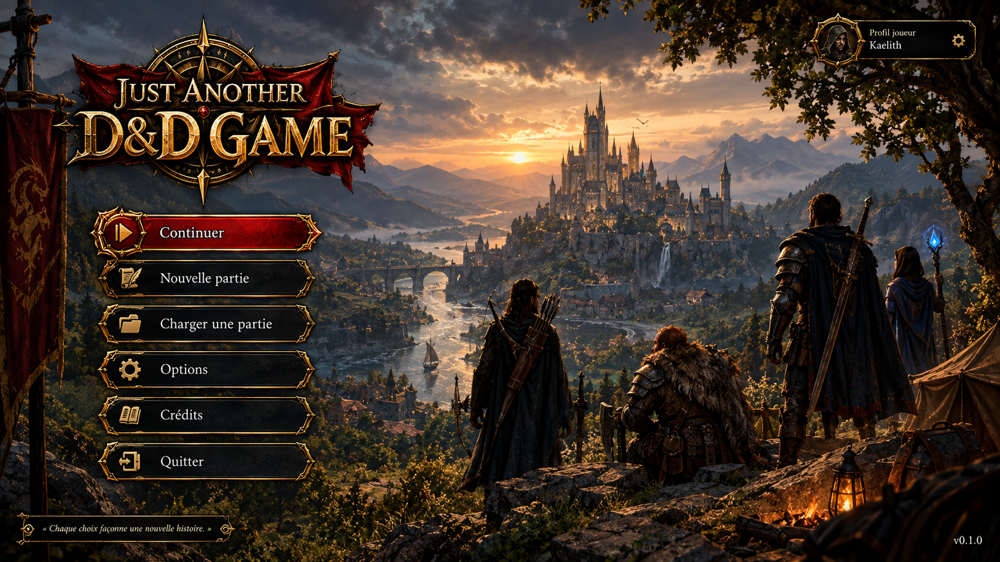
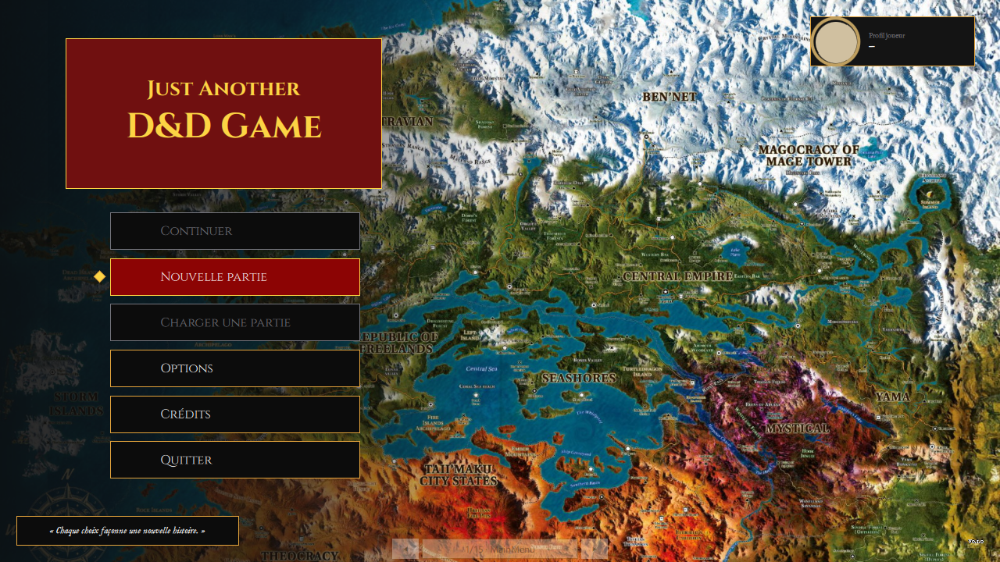
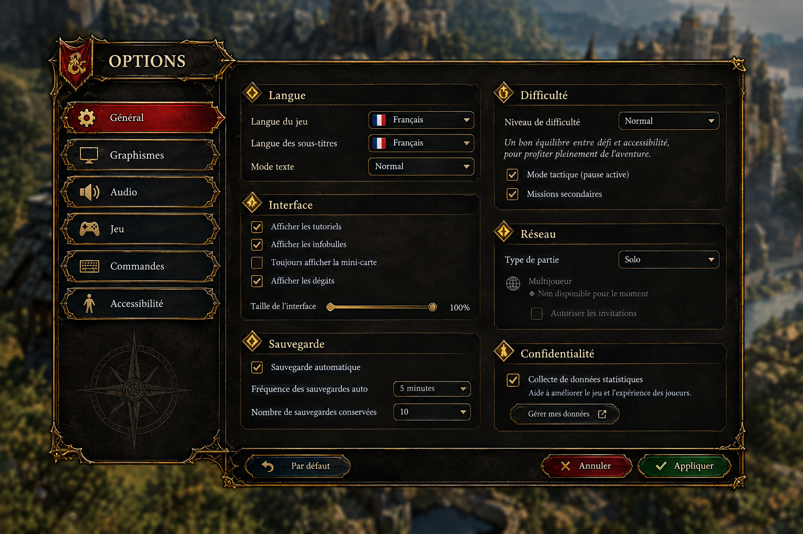
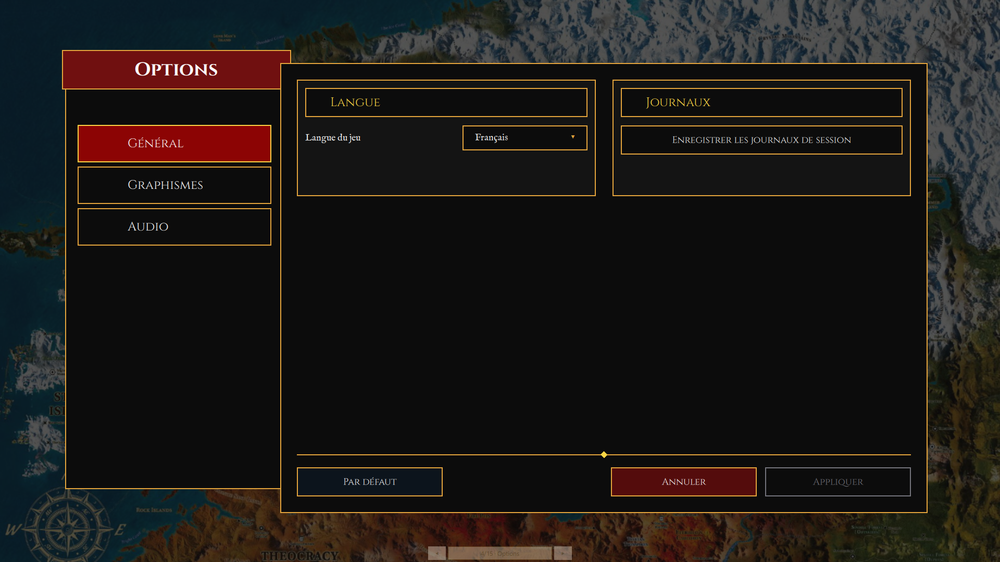
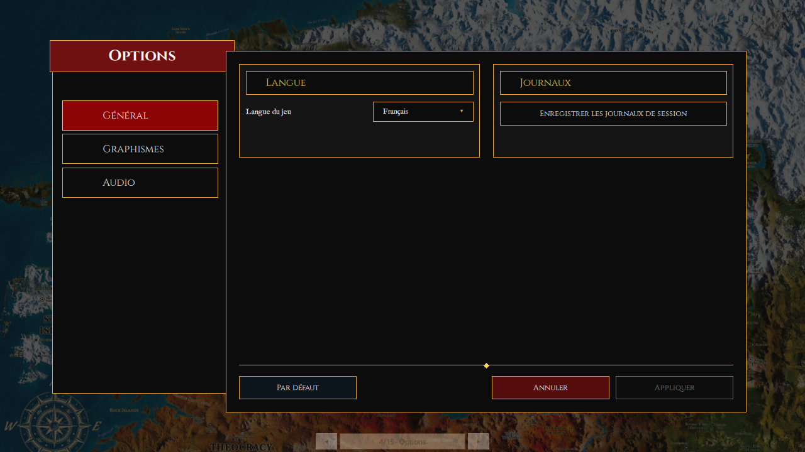
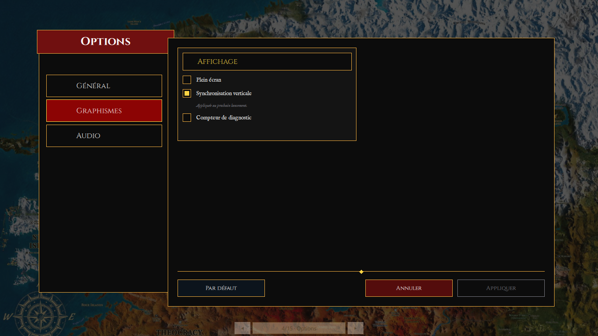

# LOT-87 — Charte v2 et intégration des maquettes {#lot-87}

> Statut : **en cours**.
> Prérequis : `LOT-86`, `LOT-39`.
>
> Exigences refondues : [`EX-IHM-070`](@ref EX-IHM-070) (charte v2, facteur réel),
> [`EX-IHM-075`](@ref EX-IHM-075) (ornements produits en images, sous trois conditions),
> [`EX-IHM-076`](@ref EX-IHM-076) (illustrations extraites ou produites, jamais sans provenance).
> Exigence précisée : [`EX-IHM-081`](@ref EX-IHM-081) (les deux facteurs).

## Objectif

Adopter les dix maquettes du pack UI comme charte visuelle v2, et transcrire les écrans du jeu sur
cette base : panneaux sombres et parchemin, `Cinzel` en titres, `IM Fell English` en corps,
illustrations peintes. Les assets (cadres 9-patch, plaques, boutons, fonds) sont produits à part, à
1080p, depuis un cahier des assets — jamais découpés des maquettes elles-mêmes, qui restent des
références de cotes et de composition.

## Pourquoi les maquettes remplacent la charte parchemin pixel

Les maquettes du pack contredisent la direction retenue par les `LOT-66` et `LOT-76` (parchemin de
Tanares, sans illustration peinte). Elles sont malgré tout la matière la plus riche dont dispose le
projet pour les dix écrans qu'elles couvrent : la décision, prise le 11 septembre 2026, est de les
adopter comme charte v2 plutôt que de continuer à les ignorer. Le prix assumé : deux directions
graphiques auront coexisté dans l'historique du dépôt, la seconde remplaçant entièrement la
première.

## Ce que Claude ne produit pas

Aucun cadre doré, aucun fond peint n'est dessiné par un modèle Claude. La phase 2 sépare deux
métiers : Claude écrit le cahier des assets (liste, dimensions, marges 9-patch, description,
prompt de génération par pièce) et vérifie/enregistre ce qui revient ; la production des images
passe par un générateur d'images ou un illustrateur, à partir de ce cahier.

## Programme, en six phases

1. **Socle vert** — dépôt propre (branches mortes archivées et retirées, débris de travail retirés,
   maquettes déplacées dans ce dossier), lot inscrit à la feuille de route.
2. **Le module de conception** — Qt Design Studio 4.8.2 ouvre chaque `*Form.ui.qml` en mode
   conception, le jeu démarre : trois modules (`Jadg.Ui`, `Jadg.App`, `Jadg.Runtime`), des
   doublures QML pour les types C++, un garde-fou de compatibilité réécrit en contrat plutôt qu'en
   structure CMake.
3. **Charte v2 et matière première** — la charte écrite dans cet epic, les jetons de `Tokens.qml`
   étendus, les polices `Cinzel` et `IM Fell English` déposées, le cahier des assets, le manifeste
   étendu aux images produites, et les briques QML (`PanelFrame`, `OrnateButton`, `StatMedallion`,
   etc.) qui les consomment.
4. **Les écrans, un par Pull Request** — menu principal, options, crédits, fiche de personnage,
   inventaire et équipement, carte du monde, équipe de mercenaires, compétences et sorts ; pause,
   dialogue, marchand et journal restylés sans redessin.
5. **Le cadre du HUD** — `CombatHudForm` et `GameViewForm` réécrits avec le cadre de la maquette,
   branchement différé aux lots qui fourniront les données réelles.
6. **Retrait** — le dossier `JustAnotherDnDGame_UI_ASSET_PACK/` et l'ancienne charte (`LOT-86`)
   supprimés une fois qu'aucun écran ne les cite plus.

## Phase 1 — le module de conception

### T1.1 — Le diagnostic, avant d'écrire

L'hypothèse du plan — *le mode conception est grisé parce que `Jadg.Ui` mêle QML et C++* — a été
mise à l'épreuve le 12 septembre 2026 en ouvrant `Source/Ui/JadgUi.qmlproject` de l'état
`main` (phase 0) dans Qt Design Studio **4.8.3** (Qt 6.8.7 embarqué, `qmlpuppet-4.8.3.exe`), puis
en résolvant chaque fichier avec le `qmllint` de ce même Qt. **Elle est fausse dans sa forme, et
juste dans son fond.**

Ce qui a été observé :

- Le mode conception **n'est pas grisé** : les formulaires s'ouvrent, le panneau Propriétés
  fonctionne, trois marionnettistes tournent (kit « Desktop Qt 6.8.7 », style Basic).
- La bibliothèque de composants liste **chaque dossier « (vide) »** — `Controls`, `Screens`,
  `Theme`, `Logic` : l'artiste ne peut poser aucune brique du projet depuis ce panneau. Première
  hypothèse : le `qmldir` engendré ne porte pas `designersupported`. **Infirmée** après coup (voir
  ci-dessous) : le mot est posé, le panneau reste vide.
- Le panneau Problèmes signale « Nom pour le type `CharacterSheetModel` manquant » et
  « `InventoryModel` manquant » (`CharacterSheet.qml`, `Inventory.qml`) : les jumeaux qui
  instancient un type C++ restent irrésolus, et `GameViewForm.ui.qml` — un *formulaire* —
  nommait `GameViewport`, lui aussi C++. Le marionnettiste ne charge aucun plugin C++ du projet ;
  tout type C++ mêlé au module des formulaires y est irrésolvable.
- Avec le `qmllint` 6.8.7 de l'atelier et `-I Source/Ui` : les 13 formulaires purs se résolvent ;
  `GameViewForm.ui.qml`, `Main.qml`, `ScreenStack.qml` et tous les jumeaux échouent sur les types
  C++ (« unqualified access » sur `OptionsModel`, `ScreenRouter`, `PendingData`).

**Cause nommée** : un module unique (`Jadg.Ui`, porté par l'exécutable) qui contient à la fois les
formulaires, le câblage et les types C++. **Critère qui la fait disparaître** : chaque formulaire
et chaque jumeau se résout avec le `qmllint` du Qt embarqué de l'atelier, sans plugin C++, et
l'atelier les ouvre sans un problème signalé.

**Ce qui reste ouvert : le panneau Composants.** Une fois la phase 1 faite (0 problème, 0
avertissement dans l'atelier), le panneau liste toujours chaque dossier « (vide) », y compris
`Mocks`. Une expérience à part — un projet jetable avec deux modules `designersupported`, l'un à
fichiers plats dans le répertoire du `qmldir`, l'autre en sous-dossiers — donne le même résultat
pour les deux : ni la disposition ni le mot ne suffisent. Ce panneau n'est pas un critère de la
phase 1 ; l'artiste pose une brique depuis la galerie `DesignStudio/Main.ui.qml` ou par le code, et
la phase 2 (T2.7, les briques de la charte v2) instruira ce qu'il exige de plus — un `.qmltypes`
ou un `designer/*.metainfo`, probablement.

La branche abandonnée (125 commits) visait le bon découpage, mais l'a fait en laissant les
fichiers en place et en réécrivant leurs chemins de ressource un par un, avec des cibles qui
vérifiaient des fichiers engendrés. C'est cette plomberie qui a dérivé, pas l'idée.

### T1.2 à T1.4 — Ce qui a été fait

Trois modules QML, **chacun déclaré dans le répertoire de ses fichiers**, sans un seul alias de
ressource :

| Module | Répertoire | Contenu | Cible |
|---|---|---|---|
| `Jadg.Ui` | `Source/Ui` | formulaires, contrôles, jetons, galerie ; QML pur, `designersupported` | `JadgUi` (statique) |
| `Jadg.Runtime` | `Source/HMI/Runtime` | les neuf types C++ exposés au QML, dont la surface de rendu | `JadgRuntime` (statique) |
| `Jadg.App` | `Source/App` (fichiers sous `Game/Qml/`) | `Main.qml`, `Logic/`, les quatorze jumeaux | `JustAnotherDnDGame` |

- La découverte de Qt, `QT_VERSION_MINIMUM`, les politiques `QTP0001`/`QTP0004` et
  `QT_QML_OUTPUT_DIRECTORY` (un seul répertoire de sortie pour les `qmldir` engendrés, celui que
  `all_qmllint` prend pour chemin d'import) vivent dans `Source/CMakeLists.txt` : trois
  répertoires frères en dépendent, et les cibles importées d'un `find_package` ne sont visibles
  que sous le répertoire qui l'a appelé.
- Les deux bibliothèques statiques sont liées avec leurs plugins (`JadgUiplugin`,
  `JadgRuntimeplugin`) : le `qmldir` embarqué les désigne (`optional plugin`, `linktarget`), et
  Qt les importe à l'édition de liens. Aucune macro dans le C++.
- `world-map.jpg` est désigné par les formulaires par un chemin **relatif à leur source**
  (`../../Elements/Assets/UI/`), et embarqué par `qt_add_resources(... BASE ...)` à l'endroit
  exact où ce chemin le cherche dans la ressource : le même chemin sert à l'atelier, aux sources
  (`JADG_QML_FROM_SOURCE=1`) et au binaire.
- La surface de rendu C++ quitte `GameViewForm.ui.qml` pour son jumeau : le formulaire réserve un
  hôte (`viewportHost`), le jumeau y pose `GameViewport`.
- `Source/Ui/Mocks/Jadg/Runtime/` : six doublures QML (`OptionsModel`, `ScreenRouter`,
  `PendingData`, `CharacterSheetModel`, `InventoryModel`, `GameViewport`) aux mêmes noms et
  propriétés que le C++ ; le `.qmlproject` les place dans ses `importPaths` et déclare les jumeaux
  dans ses `QmlFiles`. CMake ne connaît pas ce dossier.
- `scripts/check_qml_designer_compat.py` réécrit : un **contrat** en neuf règles (imports et
  motifs des formulaires, aucun type C++ dans un formulaire, doublures complètes — chaque
  `Q_PROPERTY` et `Q_INVOKABLE` a son pendant —, jumeaux appareillés, chaque fichier QML listé
  par son CMake, aucun alias ni désactivation de `qmldir` engendré, `qmldir` de conception
  `designersupported`, aucune dépendance circulaire). `check_ui_layers.py` suit la nouvelle
  arborescence (règle 1 étendue à `Runtime/`, règle 3 sur `Source/App/CMakeLists.txt`, règle 6
  étendue au câblage). `check_qt_version_pin.py` lit `Source/CMakeLists.txt`. Le pin garde son
  objet — la CI installe cette version — donc le script reste.

### T1.5 — Le test de l'artiste, passé le 12 septembre 2026

Trois changements, faits dans `Source/Ui` seulement, puis le jeu relancé avec
`JADG_QML_FROM_SOURCE=1` — **sans qu'aucun compilateur C++ n'ait tourné** :

1. **déplacer un bloc** — la colonne du menu passe de deux à six espacements extra-larges
   (`MainMenuForm.ui.qml`) ;
2. **changer un jeton** — l'accent (`Tokens.accent`) passe de l'or au bleu-vert ;
3. **remplacer un ornement** — les quatre cabochons d'angle du cadre de parchemin deviennent des
   fleurons (`ParchmentFrame.ui.qml`).

| Avant | Après |
|---|---|
|  |  |
|  |  |

Le `git diff` du test touche trois fichiers, tous sous `Source/Ui/**` ; aucun `.cpp`, aucun
`.h`, aucun fichier engendré. Les deux journaux de session ne contiennent aucun avertissement QML.

### Où en est la phase 1

- Le jeu démarre sur les quatorze écrans (`--screen=<Nom> --screenshot=`), aucun avertissement QML
  dans le journal ; `JADG_QML_FROM_SOURCE=1` relit `Source/Ui` (« Interface lue depuis les
  sources »).
- `ctest` : 1033/1033.
- Avec le `qmllint` 6.8.7 de l'atelier et les doublures : 44 fichiers sur 46 se résolvent — les
  quatorze formulaires, les quatorze contrôles, la galerie, les quatorze jumeaux. Les deux
  restants, `Main.qml` et `ScreenStack.qml`, importent `Jadg.App` lui-même : fichiers de câblage,
  rien ne s'y dessine.
- `check_qml_designer_compat.py` (196 éléments, 9 règles), `check_ui_layers.py` (278 éléments),
  `check_qt_version_pin.py`, `lint_lots.py`, `lint_exigences.py` : verts.

## Phase 2 — charte v2 et matière première

### T2.1 — La charte v2

Cette section **remplace** la direction du parchemin pixel (`LOT-66`, `LOT-76`, `LOT-86`) pour les
écrans du jeu. Elle ne réécrit pas ces lots : ils décrivent ce qui a été livré, et la v1 reste à
l'écran jusqu'à ce que la phase 3 ait transcrit chaque écran.

#### Ce qui est gardé

- **Le parchemin de Tanares**, avec ses rôles et leurs valeurs : `background`, `surface`,
  `surfaceAlt`, `text`, `textMuted`, relevés sur les feuilles de personnage du corpus. Les maquettes
  ne les contredisent pas : le champ de parchemin de l'inventaire (maquette 04) mesure `#e4d4ac`,
  contre `#e0d0b0` pour `surface` — un pas de quantification d'écart. On garde la mesure du corpus :
  c'est la source, la maquette n'en est qu'une interprétation.
- **L'or et le grenat** : `accent`, `border`, `frameOrnament`, `gem`, `gemShadow`. Les maquettes en
  ajoutent les faces éclairées (`goldLight`, `gemLight`) sans remplacer les valeurs existantes.
- **Le focus signalé par une marque**, pas par une teinte (`EX-IHM-071`) ; l'étanchéité des deux
  portées, jeu et éditeur (`EX-IHM-050`) ; aucune couleur, famille ni taille hors de `Tokens.qml`
  (`EX-IHM-105`).

#### Ce qui change

- **Deux matières, et chaque écran en choisit une.** Les **panneaux sombres** cerclés d'un filet
  d'or portent le menu principal, les options, les crédits, la carte et le HUD — des écrans posés sur
  une scène peinte, qu'ils ne doivent pas masquer. Le **parchemin** porte la fiche de personnage,
  l'inventaire, l'équipe de mercenaires et les compétences — des documents du personnage, qui se
  lisent comme la feuille du corpus. Pause et journal passent sur panneau sombre, dialogue et
  marchand sur parchemin (T3.9).
- **La typographie.** `Cinzel` — capitales romaines — pour les titres, plaques et bandeaux ;
  `IM Fell English` pour le corps ; son italique pour les citations et textes d'ambiance (rôle
  `loreFamily`). Une échelle de cinq tailles, en pixels à 1080p : 58 (titre du jeu), 36 (titre
  d'écran), 24 (section), 18 (corps), 14 (légende). Ces tailles sont celles du plan du lot, lues sur
  les maquettes ; elles se vérifient écran par écran, captures à côté de la maquette, en phase 3.
- **Les illustrations peintes** : fonds de scène, portraits, carte, et les ornements eux-mêmes —
  cadres, plaques, boutons, médaillons — livrés en **images 9-patch produites à 1080p** depuis le
  cahier des assets (T2.4), et non plus tracés (`EX-IHM-075` refondue).
- **Le facteur d'agrandissement devient réel** : `uiScale`, la fenêtre rapportée à 1920 × 1080.

#### Ce qui est écarté, et pourquoi

- **Les polices pixel** (`Pixelify Sans`, `Press Start 2P`). Une police bitmap et une illustration
  peinte ne cohabitent pas — le `LOT-66` l'avait écrit contre le pixel art, et les maquettes le
  rendent visible. Leurs fichiers partent après la phase 3, pas avant : les écrans v1 les emploient.
- **Le facteur entier hors du viewport.** Il existait pour une seule raison : à 1,5×, le trait et le
  filet d'un cadre **tracé** s'arrondissaient à la même épaisseur et la réserve de parchemin
  disparaissait. La v2 ne trace plus de filet d'un pixel ; une image 9-patch s'échantillonne à tout
  facteur. Le viewport garde l'entier : ses tuiles, elles, sont encore des pixels.
- **Le tracé des ornements.** Les filigranes d'or en relief et les plaques à grain des maquettes ne se
  tracent pas de façon crédible en `Shape` : l'essayer aurait produit une troisième direction
  graphique, ni la v1 ni les maquettes. Les trois raisons de l'ancienne `EX-IHM-075` restent, comme
  conditions imposées à chaque image.
- **Le découpage des maquettes.** Elles sont sorties d'un générateur, à une définition qui n'est pas
  celle du jeu (1536 à 1672 px de large), avec du texte incrusté : on y relève des cotes et des
  couleurs, on n'y prélève aucun pixel.
- **La scène isométrique peinte du HUD** (maquette 01). Le moteur rend un viewport en pixel art ; la
  maquette en fixe le cadre, pas la scène (T4.1).

#### La palette relevée

Chaque rôle **nouveau** est mesuré par `scripts/measure_mockup_palette.py` sur une zone nommée d'une
maquette ; la valeur écrite dans `Tokens.qml` est celle que le script imprime, et
`--check` échoue si l'une s'en écarte. `--annotate <dossier>` dessine chaque zone sur sa maquette —
c'est ainsi que les zones ont été vérifiées une à une, et corrigées quand elles mordaient sur un
libellé ou un ornement.

Trois mesures, parce qu'une maquette porte trois sortes de matière :

- **surface** — un fond sans texte ni ornement : le mode de l'histogramme quantifié de la zone ;
- **trait** — un libellé, un filet, une icône : le fond est d'abord relevé, puis seuls les pixels
  dont l'écart de luminance à ce fond atteint 60 % de l'écart le plus fort sont gardés. Un glyphe
  anticrénelé a plus de pixels de bord que de cœur : sans ce tri, le mode serait une couleur
  intermédiaire qui n'existe nulle part ;
- **lumière** — la face éclairée d'une matière en relief : le mode du quart le plus lumineux. Le mode
  de la plaque entière donne sa face ombrée — pour le grenat, c'est `#6c0404`, déjà tenu par `gem`.

Quantification à 8 niveaux par canal, et non 16 comme au `LOT-66` : les panneaux sombres tiennent
tous entre `#000000` et `#181818`, qu'un pas de 16 confond en un seul noir. Coordonnées en pixels
de la maquette elle-même.

| Rôle | Valeur | Maquette | Zone (x0, y0, x1, y1) | Mesure | Ce que la zone montre |
|---|---|---|---|---|---|
| `panel` | `#0c0c0c` | 07 crédits | (420, 470, 800, 480) | surface | fond du grand panneau, entre deux sections |
| `panelRaised` | `#141414` | 01 HUD | (1560, 288, 1640, 310) | surface | panneau des quêtes posé sur la scène, à droite du titre |
| `panelEdge` | `#e4a43c` | 05 options | (1417, 300, 1424, 800) | trait | filet d'or du bord droit du panneau |
| `goldLight` | `#fcd444` | 05 options | (466, 160, 500, 200) | trait | losange d'or de l'intertitre « Langue » |
| `gemLight` | `#8c0404` | 06 menu | (392, 372, 500, 404) | lumière | plaque grenat de l'entrée active « Continuer », après le libellé |
| `textOnPanel` | `#fcfcfc` | 06 menu | (265, 455, 420, 480) | trait | libellé « Nouvelle partie » |
| `textOnPanelMuted` | `#74747c` | 05 options | (1010, 533, 1085, 550) | trait | libellé désactivé « Multijoueur » |
| `success` | `#0c2c0c` | 05 options | (1368, 884, 1388, 902) | lumière | plaque verte d'« Appliquer », après le libellé |
| `danger` | `#540c0c` | 05 options | (1172, 884, 1196, 902) | lumière | plaque rouge d'« Annuler », après le libellé |
| `info` | `#0c141c` | 05 options | (530, 884, 552, 902) | lumière | plaque bleu nuit de « Par défaut », entre l'icône et le libellé |

Deux constats de la mesure, qui contredisent ce que l'œil proposait :

- **`success`, `danger` et `info` sont des matières de plaque, pas des couleurs de texte.** Sur les
  maquettes, la coche d'« Appliquer » est crème et la croix d'« Annuler » est dorée : ce qui dit
  « valider » ou « annuler », c'est la plaque. Aucune des trois n'est lisible en texte sur `panel`.
  Le texte posé dessus est `textOnPanel`.
- **Le filet des panneaux sombres est de l'or vif, pas du bronze.** `panelEdge` (`#e4a43c`) est plus
  proche de `goldLight` que d'`accent` (`#c0a060`, l'or mat du parchemin) : un panneau sombre se
  cercle d'or éclairé, et c'est ce qui le détache de la scène.

#### Exigences refondues

`EX-IHM-070` décrit la charte v2 et son facteur réel ; `EX-IHM-075` passe du tracé à l'image
produite, en gardant ses trois raisons comme conditions ; `EX-IHM-076` admet une seconde provenance,
la production depuis le cahier ; `EX-IHM-081` borne les deux facteurs. Chaque refonte garde le texte
ou le motif de la version précédente, et nomme ce lot. Le guide de conception suit (facteur,
échelle, ornements).

#### Laissé ouvert, et à qui

- **`EX-IHM-072` contre le T3.2.** L'exigence retire tout contrôle grisé non branché ; le plan des
  options dessine les sections de la maquette « désactivées, non disponible ». Les deux ne tiennent
  pas ensemble : le T3.2 tranche — retirer ces sections, ou refondre `EX-IHM-072` — avant d'écrire le
  formulaire. **Tranché au T3.2** : sections retirées, l'exigence est gardée.
- **`EX-IHM-053` contre le T2.4.** L'exigence veut des icônes vectorielles ; le cahier prévoit des
  icônes 64 × 64. **Tranché au T2.4** (ci-dessous) : PNG produits au double de leur taille
  d'affichage, et l'exigence refondue.
- **Les couleurs de texte du HUD** — le bleu du tour du joueur, le rouge du tour ennemi, l'or de la
  quête active (maquette 01) — ne sont pas des rôles de cette phase. Le T4.1 les relève avec le même
  script s'il en a besoin.
- **Les noms de famille des polices** (`Cinzel`, `IM Fell English`) sont ceux de leur distribution ;
  le T2.3 les confronte à la table `name` des fichiers déposés, et corrige `Tokens.qml` s'ils
  diffèrent.

### T2.2 — Les jetons

`Source/Ui/Theme/Tokens.qml` gagne, sans rien retirer :

- les **dix rôles** relevés ci-dessus, dans une section « charte v2 » qui renvoie au script ;
- **`uiScale`**, réel, 1 par défaut — la valeur de la conception, où Design Studio dessine à 1080p ;
- les **familles** : `titleFamily` passe à `Cinzel`, `bodyFamily` à `IM Fell English`, et
  `loreFamily` (même famille, en italique) s'ajoute ;
- l'**échelle typographique** v2 : `fontDisplay`, `fontScreenTitle`, `fontSectionTitle`, `fontBody`,
  `fontCaption`.

Deux écarts au plan, assumés :

- **Les tailles portent le préfixe `font`.** Le plan les nommait `display`, `screenTitle`,
  `sectionTitle`, `body`, `caption` ; quatre de ces noms sont encore ceux de la v1, que le même plan
  garde jusqu'au T5.2. Deux propriétés ne peuvent pas porter le même nom.
- **Les tailles sont multipliées par `uiScale` dans `Tokens.qml`**, et arrondies. Le plan les voulait
  « non multipliées » — non multipliées par l'**entier**, ce qu'elles sont. Les multiplier par le
  réel au même endroit garde la règle qui a évité à la v1 de diverger : un formulaire n'écrit jamais
  le facteur, donc ne peut pas l'oublier. À la conception, `uiScale` vaut 1 et le formulaire lit
  exactement 58, 36, 24, 18 et 14.

`Source/App/Game/Qml/Main.qml` lie `uiScale` à la fenêtre :
`max(0,5 ; min(largeur / 1920 ; hauteur / 1080))`. Le plus petit des deux rapports, pour que l'écran
de conception tienne entier quel que soit le format ; une liaison et non deux gestionnaires, parce
que le facteur dépend des deux dimensions ; plancher à 0,5, sous lequel un corps de 18 px ne se lit
plus. Aucune boucle (`EX-IHM-080`, `EX-IHM-081`) : aucun écran ne contraint la fenêtre.

Les grandeurs v1 (`scale`, `screenTitle`… `frameThickness`) sont **marquées obsolètes** dans le
fichier et restent lues par les quatorze écrans. **Conséquence visible, attendue** : les écrans v1
lisent `bodyFamily` et `titleFamily`, qui nomment désormais des polices que le jeu n'enregistre pas
encore. Jusqu'au T2.3, ils s'affichent dans la famille générique de repli (`EX-IHM-052`) — tailles et
mise en page inchangées. Le journal ne le signale pas : il ne dit qu'un fichier absent de la liste de
`registerIdentityFonts()`, où ces polices n'entrent qu'au T2.3.

### T2.4 — Le cahier des assets

Le cahier est une page à part, @subpage lot-87-cahier-assets, et son jumeau machine
`assets-brief.json`, validé contre `assets-brief.schema.json` par `scripts/check_assets_brief.py`.
**80 pièces, 214 images** (une par état ou par membre d'un jeu d'icônes), en onze familles ; chacune
porte sa clé au format du `LOT-39` (`ui/<famille>/<pièce>`), sa taille de production à 1080p, ses
marges 9-patch ou sa taille fixe, son fond, ses états, sa description, son prompt, les zones de
maquette qui la montrent, les écrans qui la posent et l'aplat de jetons qui la remplace tant qu'elle
manque. Six éléments des maquettes sont écartés du cahier avec leur raison (carte, portraits, icônes
d'objets, scène du HUD, illustrations de la base, planche 02).

Ce que la tâche a décidé, en plus de la liste :

- **Le prompt est assemblé, pas recopié.** Style, matière, interdit des lettres, prompt de la pièce,
  variante, toile et règle d'étirement sont mis bout à bout par `--prompt <clé>`, et chaque couleur ou
  famille qu'il impose est lue dans `Tokens.qml` à ce moment-là. Une palette recopiée dans 214 prompts
  aurait divergé au premier jeton changé.
- **La page est engendrée.** Les tables de la page du cahier sortent du JSON (`--write`) ; la CI
  échoue si elles ne le suivent plus.
- **`EX-IHM-053` refondue** : les icônes du jeu sont des PNG produits à deux fois leur taille
  d'affichage (128 × 128 pour 32 à 64 px), réduits avec lissage ; celles de l'éditeur restent
  vectorielles.
- **Un remplissage de jauge n'est pas une image** : un relief en niveaux de gris posé sur un aplat
  des jetons, comme `EX-IHM-075` le demande. Le plan prévoyait trois remplissages peints.
- **Le logotype est la seule pièce qui porte des lettres** ; la signature de la fiche devient un
  paraphe sans nom.
- **Six onglets d'options**, pas huit : ceux de la maquette 05.

Les zones ont été relevées sur les maquettes puis contrôlées en les y dessinant (`--annotate`) ; une
seule mordait à côté, corrigée. Le garde-fou a été éprouvé par injection : zone hors maquette, jeton
inconnu, marges sans milieu, clé en double, pièce dérivée d'une pièce absente, marges sur une pièce
fixe, `{jeton}` hors palette, écran sans pièce, page en retard — chacune le fait échouer.

### T2.5 — Le manifeste étendu aux images produites

`illustrations.json` ne connaissait qu'une provenance, l'extraction du corpus (`document`, `page`,
`region`). Une seconde provenance s'ajoute, `"produced"` : la clé du cahier (`cahier`), le prompt
tel qu'assemblé et envoyé (`prompt`), la date (`date`), et pour une pièce 9-patch les marges
(`margins`, celles du cahier, recopiées à la lettre). Les champs d'empreinte et de dimensions
(`sha256`, `bytes`, `size`) restent communs aux deux provenances : une image produite se vérifie
comme une image extraite, seule sa provenance et ce qu'elle cite diffèrent.

`scripts/check_ui_assets.py` garde ses trois contrôles (empreinte, dimensions, orphelin — étendu à
`UI.rglob()` pour suivre les images produites dans leurs sous-dossiers de famille), et en gagne
deux :

- une illustration produite doit citer une clé du cahier qui existe (`cahier_keys()`, la même
  fonction qui déplie les clés de variante que `check_assets_brief.py`) ;
- chaque clé du cahier finit par avoir un fichier (une entrée `"produced"` la cite), ou une mention
  explicite « non livrée » dans une nouvelle section `pending` du manifeste — une entrée sans
  `keys` couvre toute clé qu'aucune entrée produite ne cite (la portée générale posée maintenant,
  puisqu'aucune pièce n'est encore produite), une entrée avec `keys` nomme des clés précises.

Le recoupement avec le code (`check_code_keys`) ne porte plus que sur les illustrations
**extraites** : une image produite n'est nommée par aucun écran avant que le T2.7 pose les briques
qui la consomment, l'exiger maintenant aurait fait échouer le contrôle sur chaque pièce livrée
avant son écran.

**Vérifié par injection** : un fichier déposé sans entrée (orphelin), une clé de cahier inconnue
citée par une entrée produite, la section `pending` vidée avec les 214 clés du cahier encore non
couvertes — chacune fait échouer `check_ui_assets.py` avec un message qui nomme la clé en cause.

### T2.6 — La réception des images produites

`scripts/receive_ui_assets.py` : un dossier de PNG livrés par le générateur, chacun nommé par la
clé du cahier qu'il porte (`ui/frame/panel-dark.png` → `ui__frame__panel-dark.png`, une variante
`ui/button/apply/hover` → `ui__button__apply__hover.png`). Pour chaque fichier : la clé existe dans
le cahier et n'a pas déjà été reçue, les dimensions et la présence d'un canal alpha (octet de type
de couleur de l'en-tête PNG) correspondent à ce que la pièce annonce. Ce qui passe est installé
sous `installRoot/<famille>/...` (la clé, préfixe `ui/` ôté) et ajouté au manifeste avec le prompt
assemblé par `check_assets_brief.assembler()` — le même module est réutilisé, pas recopié. Ce qui
échoue est refusé avec le motif, pour régénération ; `--dry-run` rapporte sans rien écrire.

Ce que le script ne vérifie pas — lettres incrustées, fidélité de la matière au prompt — reste une
relecture humaine avant de le lancer : ce sont des jugements, pas des mesures.

**Vérifié** : un dossier de quatre PNG de test (une pièce fixe valide, une pièce 9-patch valide,
une clé de variante mal formée, une clé inconnue, une pièce aux mauvaises dimensions, une pièce
sans le canal alpha attendu) — les deux valides installées et déclarées, les quatre autres
refusées avec leur motif ; `check_ui_assets.py` reste vert après une installation réelle.

Aucune pièce n'est encore produite : la production (le générateur d'images, hors de portée de
Claude) n'a pas tourné. Le cahier et les deux scripts sont la matière prête à la recevoir.

### T2.7 — Les briques de la charte v2

Treize briques dans `Source/Ui/Controls/`, toutes en `.ui.qml`, toutes nommées par le plan :

| Brique | Base | Pièces du cahier | Propriétés qui choisissent la pièce |
|---|---|---|---|
| `PanelFrame` | `Item` | `ui/frame/panel-*`, `subpanel-*` | `material`, `subpanel`, `bound`, `empty` ; le contenu se pose dedans, en retrait de `padding` |
| `TitlePlate` | `Item` | `ui/plate/title-garnet`, `title-black` | `material`, `text` |
| `SectionBanner` | `Item` | `ui/plate/section-banner`, `section-bar` | `material`, `text` |
| `OrnateButton` | `Button` | `ui/button/<kind>/<état>` | `kind` (`menu`, `primary`, `secondary`, `apply`, `cancel`, `default`, `back`), `iconKey`, `forcedState` |
| `OrnateTab` | `TabButton` | `ui/tab/ribbon/<état>`, `segment/<état>` | `material`, `iconKey`, `forcedState` |
| `OrnateCheck` | `CheckBox` | `ui/control/checkbox/<état>` | `forcedState` |
| `OrnateSlider` | `Slider` | `ui/control/slider-track`, `slider-handle/<état>` | `forcedState` |
| `OrnateCombo` | `ComboBox` | `ui/control/combo/<état>`, `combo-popup` | `forcedState` |
| `StatMedallion` | `Item` | `ui/medallion/ability`, `derived-stat` | `kind`, `label`, `value`, `modifier` |
| `PortraitFrame` | `Item` | `ui/medallion/portrait-round/<état>`, `portrait-square/<état>`, `portrait-hud`, `level-pip` | `shape`, `source`, `active`, `level`, `size` |
| `ItemSlot` | `Item` | `ui/slot/item/<état>`, `rarity/<rareté>`, `quantity-pip` | `iconSource`, `rarity`, `quantity`, `selected`, `equipped`, `forcedState` ; `pointer` pour le jumeau |
| `Gauge` | `Item` | `ui/gauge/track`, `fill-sheen` | `kind` (`health`, `experience`, `weight`), `value`, `label` |
| `GoldDivider` | `Item` | `ui/control/divider-gold` | — |

Et deux porteurs d'image qu'elles partagent, hors de la liste du plan : `NinePatchArt` (une pièce
9-patch) et `FixedArt` (une pièce de taille fixe). Ils existent pour qu'aucune brique ne réécrive le
calcul d'échelle ni la règle « livrée ou repli ».

Ce que la tâche a décidé :

- **Une brique nomme une clé du cahier, jamais un fichier.** `Source/Ui/Theme/Artwork.qml`, un
  singleton, dit quelles pièces sont livrées : une table `delivered` (clé → fichier, marges) et le
  dossier résolu `baseUrl`. Pas de fonction : Qt Design Studio refuse tout appel de fonction dans un
  `.ui.qml`, et le `qmllint` de Qt 6.11 le signale (`FunctionsNotSupportedInQmlUi`). Tant qu'une pièce
  manque, la brique dessine l'**aplat de repli** que le cahier lui prévoit (`fallback`), avec les
  jetons ; le jour où elle arrive, la même brique la pose sans qu'un formulaire change. Pourquoi une
  table et non « essayer le fichier » : un `BorderImage` qui échoue écrit un avertissement QML par
  instance, et le journal de session — qui sert de preuve à chaque porte — serait noyé.
- **La table est engendrée, pas tenue.** `receive_ui_assets.py` la réécrit à chaque réception, depuis
  les entrées `produced` du manifeste ; `check_ui_assets.py` échoue si elle ne le suit plus
  (`--write-artwork` la répare) et si une brique nomme en toutes lettres une pièce absente du cahier.
- **Les 9-patch sont posés à la taille de conception, puis réduits d'un bloc.** Les marges d'un
  `BorderImage` sont en pixels de l'image et ne suivent pas l'élément : à 720p, des coins de 112 px
  mangeraient un panneau réduit aux deux tiers. `NinePatchArt` pose l'image à `taille / uiScale` et
  la ramène par `scale: uiScale` — coins, bords et centre dans les proportions de la maquette.
- **Les contrôles sont des contrôles Qt restylés** (`Button`, `TabButton`, `CheckBox`, `Slider`,
  `ComboBox`), pas des dessins qui les imitent : clavier, manette, glisser et accessibilité viennent
  avec, et un jumeau branche `clicked` ou `checked` comme sur tout contrôle. Le style `Basic`, que
  `Main.cpp` impose, est celui qui accepte `background`, `contentItem`, `indicator` et `handle`.
- **Les états sont des propriétés.** L'état visuel se déduit de ce que le contrôle sait (`enabled`,
  `down`, `hovered`, `highlighted`, `checked`) ; `forcedState` l'impose — ce qui permet à la galerie,
  et à l'atelier où l'on ne survole rien, de montrer chaque état côte à côte. Pour une entrée de menu,
  `active` est l'entrée **courante** (`highlighted`), celle que désigne le clavier ou la manette.
- **Le remplissage d'une jauge et celui d'un curseur sont des aplats de jetons**, jamais une image
  étirée à la largeur de la valeur (qui en déformerait les extrémités) ; la jauge y pose le relief en
  niveaux de gris du cahier (`fill-sheen`), comme le T2.4 l'a tranché.
- **`Tokens.qml` gagne `gapSmall`, `gapMedium`, `gapLarge` (8, 16, 32 à 1080p) et `strokeWidth`**
  (le trait des aplats de repli, jamais sous un pixel). Préfixe `gap` pour la même raison que `font` :
  `spaceSmall` et ses voisins sont encore ceux de la v1.
- **La galerie est `DesignStudio/Main.ui.qml`**, posée telle quelle par `ScreenStack` sous
  `--screen=Gallery` et en dernier dans le sélecteur de développement. Import qualifié
  (`import Jadg.Ui as Ui`) : `Jadg.Ui` et `Jadg.App` exportent tous deux un type `Main`.
- **Un écart à la règle « plus personne ne touche à CMake »** de la porte 1, et un seul en plus de la
  liste des fichiers : les images produites entrent dans la ressource par motif
  (`UI/*/*.png`, `CONFIGURE_DEPENDS`). Sans lui, la première livraison serait installée, déclarée,
  dite livrée par `Artwork.qml`… et introuvable dans le binaire. Le motif ne remplace aucune liste :
  celle qui fait foi reste le manifeste, dont `check_ui_assets.py` refuse déjà tout fichier absent.

**Vérifié de bout en bout** avec quatre mires PNG (coins, bords et centre de trois couleurs, aux
marges exactes du cahier) : `receive_ui_assets.py` les installe et réécrit `Artwork.qml`,
`check_ui_assets.py` reste vert, le jeu reconstruit les embarque par le motif, et la galerie les pose
à 720p avec des extrémités de plaque de 107 px (160 × 2/3). Mires retirées ensuite. La mire a montré
une contrainte que le cahier implique sans la dire : **un 9-patch plus petit que ses deux marges
superpose ses coins** — 224 px de haut au moins pour `panel-dark`, 256 pour `panel-parchment`. Les
écrans de la phase 3 prennent un sous-panneau en deçà.

Laissé ouvert : **le panneau Composants de l'atelier** (constat de la phase 1, toujours « (vide) »).
Les briques se posent depuis la galerie ou par le code ; un `.qmltypes` ou des `designer/*.metainfo`
restent l'hypothèse, et ne sont pas instruits ici.

### Où en est la phase 2 — vérifié le 13 septembre 2026

- `scripts/build.ps1 -Preset ninja -Test` : construction propre, `ctest` 1033/1033.
- Les quatorze écrans se chargent (`--screen=<Nom> --screenshot=`) : quatorze captures écrites, code
  de sortie 0, aucune ligne d'avertissement QML ni d'erreur dans le journal. Mise en page v1
  inchangée, en famille de repli.
- `qmllint` du Qt 6.8.7 de l'atelier, avec les doublures : muet sur `Tokens.qml`,
  `MainMenuForm.ui.qml` et `OptionsForm.ui.qml`.
- `measure_mockup_palette.py --check` (10 rôles, 0 divergence), `check_ui_layers.py`,
  `check_qml_designer_compat.py`, `lint_exigences.py` (352/352), `lint_lots.py` : verts. Doxygen sans
  erreur.

## Phase 3 — les écrans

### T3.1 — Le menu principal (maquette 06)

`MainMenuForm.ui.qml` réécrit sur les briques v2, cotes relevées sur la maquette (1672 × 941) et
ramenées à 1920 × 1080, puis multipliées par `Tokens.uiScale` : scène en fond, logotype, six entrées
à icône, encart de profil, citation, version.

- **Six entrées, deux sans destination.** « Continuer » et « Charger une partie » sont dessinées à
  leur place dans l'état `disabled` d'`OrnateButton`, jusqu'à la sauvegarde (`LOT-17`). Le jumeau ne
  les rend jamais courantes : les flèches les sautent, un bouton désactivé n'émet ni survol ni clic,
  et `activate()` refuse une entrée désactivée. L'écran s'ouvre donc sur « Nouvelle partie ».
  `continueAvailable` et `loadAvailable` les rallumeront sans toucher au formulaire.
- **La marque de focus.** La plaque grenat de l'entrée active est une teinte ; `EX-IHM-071` veut une
  marque. Un losange d'or (`FocusMark`, pièce `ui/control/focus-fleuron`) se pose devant l'entrée
  courante.
- **Quatre briques de plus**, pour les pièces du menu qui n'en avaient pas : `CoverArt` (troisième
  porteur d'image, pour les pièces `display: cover`), `LogoPlate` (`ui/plate/logo`, dont le repli
  écrit le nom en deux lignes et s'efface le jour où l'image, qui porte ses lettres, arrive),
  `QuotePlate` (`ui/plate/quote`) et `FocusMark`. Les trois premières servent aussi aux crédits
  (T3.3) ; toutes sont dans la galerie.
- **La version** vient de `core::Engine::version()` par `QCoreApplication::setApplicationVersion`,
  lue en QML par `Qt.application.version` : aucun type C++ ni doublure de plus.
- **Le profil** est en attente : `main_menu.profile.name` et `main_menu.profile.portrait`
  (`PendingData`). Aucun lot ne tient de profil de joueur ; le cadre de portrait prend son état
  `empty`.
- La navigation réelle ne change pas : Nouvelle partie, Options, Crédits, Quitter appellent le
  routeur comme avant. Clavier et pointeur pilotent le même `currentIndex` ; les boutons ne prennent
  pas le focus (`Qt.NoFocus`), qui reste à l'écran et à ses touches.

Écarts assumés :

- **Aucune pièce n'est livrée.** Le plan voulait fonds, cadres, plaques, boutons et contrôles livrés
  avant la phase 3 ; la production n'a pas tourné. L'écran est posé sur les aplats de repli des
  briques, qui céderont la place aux images sans qu'une ligne du formulaire change. Les captures
  ci-dessous jugent la **mise en page**, pas la matière.
- **La scène de repli est la carte de Tanares**, et non l'aplat `panel` que le cahier prévoit pour
  `ui/background/menu-scene` : un menu noir aurait caché la composition que la capture doit montrer,
  et la carte est une illustration extraite, déjà déclarée. Le dégradé sombre du tiers gauche ne
  s'affiche qu'avec ce repli : la scène produite est peinte avec un tiers gauche sombre.
- **Logotype à 608 px de large**, mesuré sur la maquette, et non les 532 px du cahier. **Encart de
  profil à 96 px de haut**, et non 80 : un 9-patch plus petit que ses deux marges superpose ses
  coins.
- **Pas de roue dentée dans l'encart de profil** : elle n'ouvre rien que le menu n'ouvre déjà, et
  aucune pièce du cahier ne la porte.
- **`EX-IHM-072`** retire tout réglage inopérant. Deux entrées désactivées ne sont pas des réglages,
  et le plan les veut visibles ; l'exigence n'est pas refondue ici. Le T3.2, qui tranche le cas des
  options, dira si la règle s'étend aux entrées de menu.

| Maquette | 1920 × 1080 | 1280 × 720 |
|---|---|---|
|  |  |  |

### T3.2 — Les options (maquette 05)

**`EX-IHM-072` contre le plan : tranché le 14 septembre 2026, l'exigence est gardée.** Aucune
section de la maquette sans réglage branché n'est dessinée, même désactivée. Il reste donc **trois
onglets sur six** : Général (langue, journaux), Graphismes (plein écran, synchronisation verticale,
compteur de diagnostic), Audio (volume). Jeu, Commandes et Accessibilité reviendront avec leurs
réglages, et les sections Difficulté, Réseau, Sauvegarde et Confidentialité avec les leurs.

- **Colonne d'onglets** sous la plaque de titre grenat : ce sont des `OrnateButton` de genre `menu`,
  la pièce que le cahier prévoit aussi pour les onglets verticaux. La rose des vents en filigrane
  (`FixedArt`) n'apparaît qu'une fois livrée. Changement d'onglet au pointeur, ou par `PageUp` et
  `PageDown`.
- **Grand panneau sombre** : chaque section est un sous-panneau coiffé d'un `SectionBanner` sombre,
  deux colonnes de même largeur. Les contrôles sont les briques Qt restylées (`OrnateCheck`,
  `OrnateSlider`, `OrnateCombo`).
- **La barre de pied a un sens réel.** Les boutons Annuler et Appliquer de la maquette auraient été
  inopérants sur un modèle qui écrit à chaque geste. Les contrôles tiennent donc les valeurs **en
  attente** : « Appliquer » les écrit dans `OptionsModel` et ne s'allume que si une valeur diffère
  du réglage enregistré (`dirty`) ; « Annuler » et `Échap` ferment l'écran sans rien écrire ;
  « Par défaut » pose les valeurs d'usine dans les contrôles, sans les écrire non plus.
- **`OptionsModel.defaults`**, propriété constante nouvelle (et sa doublure) : les valeurs d'usine,
  que le constructeur lit aussi quand rien n'est enregistré. Une seule table, et non une recopie en
  QML qui aurait divergé.
- Le fond reprend le repli du menu (carte de Tanares), sous un voile de `panel` : le décor produit
  `ui/background/options-backdrop` est déjà flou et sombre.

Conséquence assumée : le volume et la langue ne s'appliquent plus au glisser ou au choix, mais à
« Appliquer ». C'est ce que la barre de pied de la maquette promet.

| Maquette | 1920 × 1080 (Général) | 1280 × 720 (Général) | 1280 × 720 (Graphismes) |
|---|---|---|---|
|  |  |  |  |

## Exigences couvertes

- [`EX-IHM-070`](@ref EX-IHM-070), [`EX-IHM-075`](@ref EX-IHM-075), [`EX-IHM-076`](@ref EX-IHM-076),
  [`EX-IHM-081`](@ref EX-IHM-081) : refondues ou précisées par la phase 2 (T2.1), pour décrire la
  charte v2.
- [`EX-IHM-053`](@ref EX-IHM-053) : refondue par le T2.4 — les icônes des écrans du jeu sont
  produites, au double de leur taille d'affichage.

## Où en est le lot

**Phases 0 et 1 livrées** (PR #25 et #26) ; **phase 2 faite** — T2.1 à T2.7 (branche
`lot/LOT-87-phase-2-charte-jetons`), en attente de la porte 2 (revue des jetons et des briques). Le
cahier (T2.4) est la première chose à faire produire : c'est le chemin critique du lot. Le manifeste
(T2.5), la réception (T2.6) et les briques (T2.7) sont prêts à recevoir ce qui en revient — une
pièce réceptionnée apparaît dans la galerie sans autre changement. La clôture du T2.6 (fonds,
cadres, plaques, boutons et contrôles livrés) attend toujours la production.

Rappel de la phase 0 :

- Branches mortes (dix-neuf) archivées sous des tags `archive/<nom>` et retirées localement ; les
  branches distantes correspondantes restent à retirer (nécessite une confirmation explicite, hors
  de portée de l'automatisation).
- `main` avancé sur `origin/main`, les trois worktrees obsolètes purgés.
- `lot/LOT-87-charte-v2` ouverte depuis `main` ; `scripts/check_qml_designer_compat.py` et
  `Source/Ui/DesignStudio/Main.ui.qml` récupérés depuis `archive/fix/qt-designer-6.8.7-compatibility`
  pour la phase 1.
- Les dix maquettes déplacées dans `references/`.
- Ce dossier créé : comme tout lot démarré, le `LOT-87` quitte `roadmap-0.1.0.md` pour cet epic,
  et `lots.md` porte désormais son `@subpage lot-87`.

## Critères d'acceptation de la phase 0

- `git branch -a` ne liste plus que `main`, `gh-pages` et `lot/LOT-87-charte-v2`, hors branches
  distantes en attente de suppression manuelle.
- La branche construit et démarre sur les quatorze écrans via `scripts/build.ps1 -Test` (`ctest` :
  1033/1033 le 12 septembre 2026).
- `check_ui_assets.py`, `check_ui_layers.py`, `lint_lots.py`, `lint_exigences.py` verts.
- Doxygen sans erreur.
