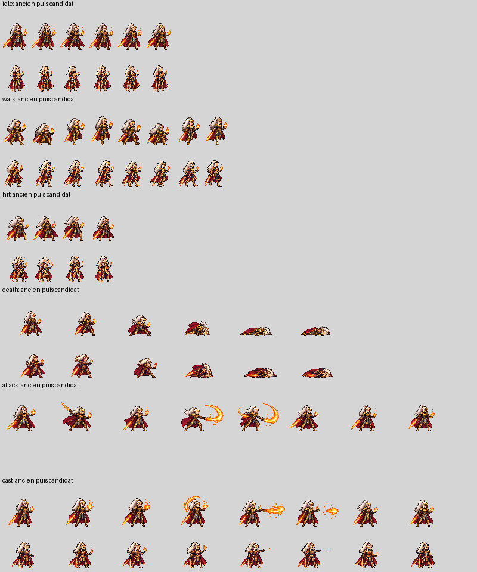
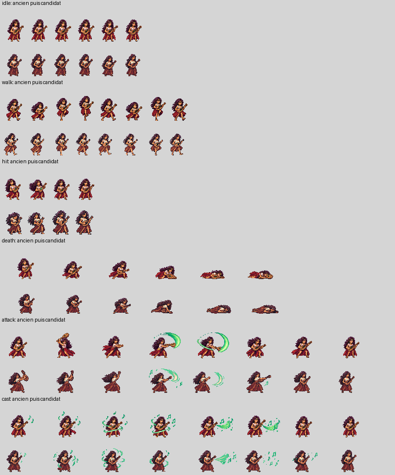
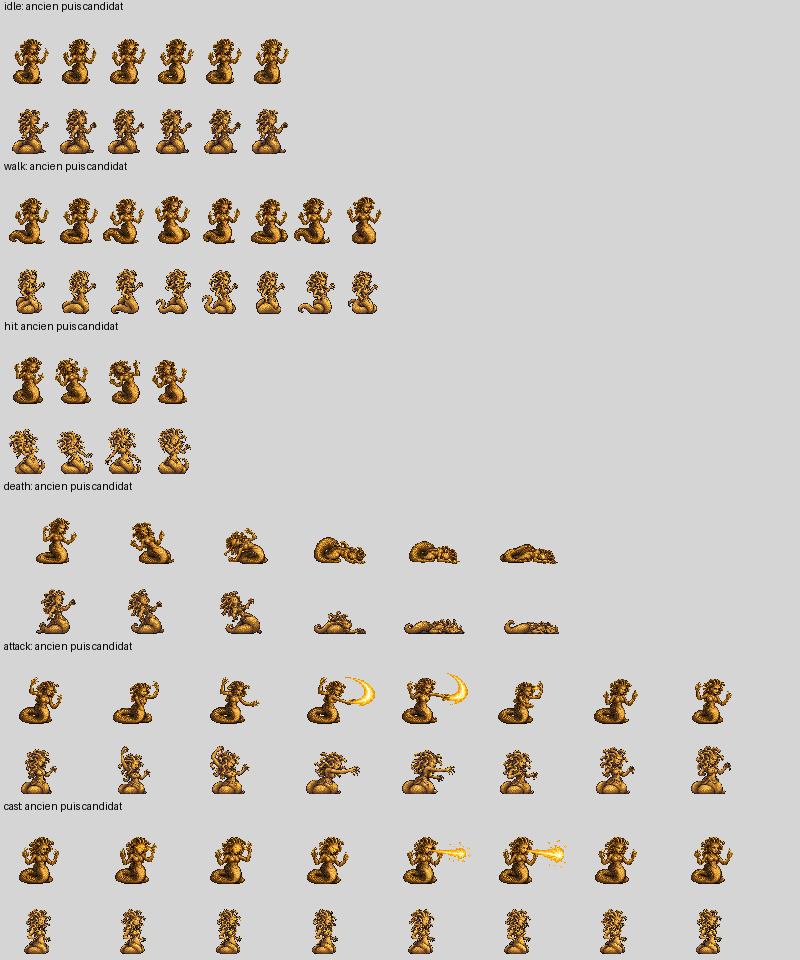
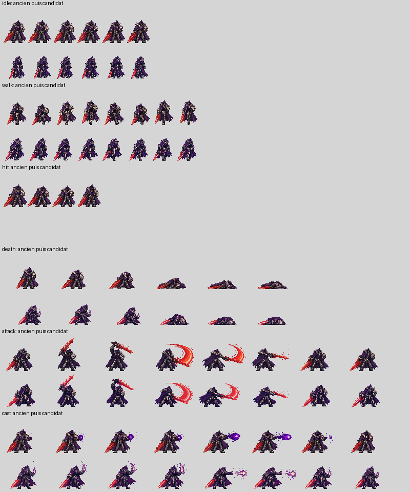
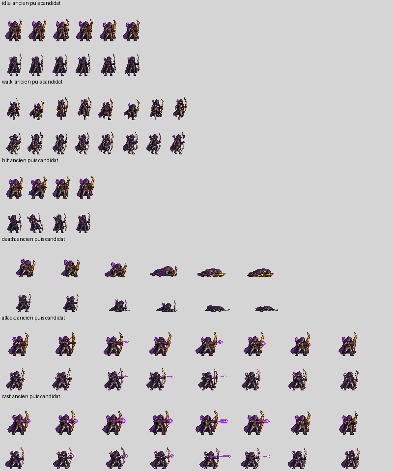

# PoC Fabrique d’assets — état de production

Génération dans le chat local. Aucun coût ni usage inventé. Les verdicts indécis bloquent.

Voir [le bilan du premier essai](bilan-poc.md). Une réception réussie ne vaut pas validation artistique ni intégration.

## anariel

État : rejected

[Mesures détaillées](assets/Npc/anariel/qc.json) · [Provenance](assets/Npc/anariel/provenance.json)

[cast](assets/Npc/anariel/proofs/cast.gif) · [death](assets/Npc/anariel/proofs/death.gif) · [hit](assets/Npc/anariel/proofs/hit.gif) · [idle](assets/Npc/anariel/proofs/idle.gif) · [walk](assets/Npc/anariel/proofs/walk.gif)

- attack-001 : rejected — Disposition indivisible : rangées ambiguës
- attack-002 : rejected — {'attack': 'frame 2: dépassement ancre'}
- attack-003 : rejected — {'attack': 'frame 3: dépassement ancre'}
- cast-001 : rejected — Disposition indivisible : rangées ambiguës
- cast-002 : rejected — {'cast': 'frame 5: dépassement ancre'}
- cast-003 : generated — réception effectuée, revue distincte
- hit-001 : generated — réception effectuée, revue distincte
- hit-002 : rejected — {'hit': 'frame 1: dépassement ancre'}
- hit-003 : generated — réception effectuée, revue distincte
- idle-001 : generated — réception effectuée, revue distincte
- portrait-001 : generated — réception effectuée, revue distincte
- sheet-001 : rejected — {'hit': '3 figures détectées, 4 attendues ; aucune substitution', 'idle': 'frame 1: dépassement ancre', 'walk': 'frame 1: dépassement ancre', 'attack': 'frame 0: dépassement ancre', 'cast': 'frame 0: dépassement ancre'}
- walk-001 : generated — réception effectuée, revue distincte
- walk-002 : generated — réception effectuée, revue distincte

- Blocage : Seuils provisoires : calibration non validée
- Blocage : attack: animation absente

Rejet après lecture du brut cast-003 et de comparison.png : deux lames visibles au sort ; attaque absente après refus de débordement. Gardes de proportions différentes entre passes.

## jade

État : review

[Mesures détaillées](assets/Npc/jade/qc.json) · [Provenance](assets/Npc/jade/provenance.json)

[attack](assets/Npc/jade/proofs/attack.gif) · [cast](assets/Npc/jade/proofs/cast.gif) · [death](assets/Npc/jade/proofs/death.gif) · [hit](assets/Npc/jade/proofs/hit.gif) · [idle](assets/Npc/jade/proofs/idle.gif) · [walk](assets/Npc/jade/proofs/walk.gif)

- hit-001 : generated — réception effectuée, revue distincte
- portrait-001 : generated — réception effectuée, revue distincte
- sheet-001 : rejected — {'hit': 'frame 1: dépassement ancre'}
- walk-001 : generated — réception effectuée, revue distincte

- Blocage : Seuils provisoires : calibration non validée

À revoir après lecture de comparison.png : instrument conservé et six bandes présentes, mais pose de coup plus grande que la garde et palette sombre. Aucun accord sur calibration ou intégration.

## lizz

État : rejected

[Mesures détaillées](assets/Npc/lizz/qc.json) · [Provenance](assets/Npc/lizz/provenance.json)

[attack](assets/Npc/lizz/proofs/attack.gif) · [cast](assets/Npc/lizz/proofs/cast.gif) · [death](assets/Npc/lizz/proofs/death.gif) · [hit](assets/Npc/lizz/proofs/hit.gif) · [idle](assets/Npc/lizz/proofs/idle.gif) · [walk](assets/Npc/lizz/proofs/walk.gif)

- attack-001 : rejected — {'attack': '3 figures détectées, 4 attendues ; aucune substitution'}
- attack-002 : generated — réception effectuée, revue distincte
- cast-001 : generated — réception effectuée, revue distincte
- hit-001 : generated — réception effectuée, revue distincte
- portrait-001 : generated — réception effectuée, revue distincte
- sheet-001 : rejected — {'hit': '3 figures détectées, 4 attendues ; aucune substitution', 'walk': 'frame 3: dépassement ancre'}
- walk-001 : generated — réception effectuée, revue distincte

- Blocage : Seuils provisoires : calibration non validée

Rejet après lecture de comparison.png : sort et attaque présentent un corps plus petit que idle, malgré la boîte de 45 pixels. La hauteur inclut les bras. Mouvement de queue à confirmer après correction corporelle.

## nakral

État : rejected

[Mesures détaillées](assets/Npc/nakral/qc.json) · [Provenance](assets/Npc/nakral/provenance.json)

[attack](assets/Npc/nakral/proofs/attack.gif) · [cast](assets/Npc/nakral/proofs/cast.gif) · [death](assets/Npc/nakral/proofs/death.gif) · [idle](assets/Npc/nakral/proofs/idle.gif) · [walk](assets/Npc/nakral/proofs/walk.gif)

- attack-001 : generated — réception effectuée, revue distincte
- hit-001 : rejected — {'hit': 'frame 0: rognage interdit (53, 45) dans 48x64'}
- hit-002 : rejected — {'hit': 'frame 0: dépassement ancre'}
- idle-001 : rejected — {'idle': 'frame 3: dépassement ancre'}
- idle-002 : generated — réception effectuée, revue distincte
- portrait-001 : generated — réception effectuée, revue distincte
- sheet-001 : rejected — {'idle': 'frame 0: dépassement ancre', 'walk': 'frame 1: dépassement ancre', 'hit': 'frame 0: rognage interdit (53, 46) dans 48x64', 'attack': 'frame 2: dépassement ancre'}
- walk-001 : generated — réception effectuée, revue distincte

- Blocage : Seuils provisoires : calibration non validée
- Blocage : attack: dessin au bord utile : rognage possible
- Blocage : cast: dessin au bord utile : rognage possible
- Blocage : hit: animation absente

Rejet après lecture de comparison.png : hit absent après refus de débordement ; attaque et sort touchent le bord utile, proportions et portée de lame changent.

## xorius

État : rejected

[Mesures détaillées](assets/Npc/xorius/qc.json) · [Provenance](assets/Npc/xorius/provenance.json)

[attack](assets/Npc/xorius/proofs/attack.gif) · [cast](assets/Npc/xorius/proofs/cast.gif) · [death](assets/Npc/xorius/proofs/death.gif) · [hit](assets/Npc/xorius/proofs/hit.gif) · [idle](assets/Npc/xorius/proofs/idle.gif) · [walk](assets/Npc/xorius/proofs/walk.gif)

- attack-001 : generated — réception effectuée, revue distincte
- cast-001 : generated — réception effectuée, revue distincte
- portrait-001 : generated — réception effectuée, revue distincte
- portrait-002 : generated — réception effectuée, revue distincte
- sheet-001 : rejected — {'attack': '5 figures détectées, 4 attendues ; aucune substitution'}
- walk-001 : generated — réception effectuée, revue distincte

- Blocage : Seuils provisoires : calibration non validée
- Blocage : walk: raccord de boucle discontinu

Rejet après lecture du brut walk-001 et de comparison.png : jambes trop similaires, raccord mesuré discontinu, proportions réduites par la hauteur de l’arc et palette trop sombre.
